# Cohesity vRO Plugin Deployment Guide                                                                                           

The **Cohesity vRealize Orchestrator (vRO)** Plugin provides self-service workflows for **Cohesity DataPlatform**. The **vRO plugin** is developed on the **Vmware vRealize Orchestrator** component of the **VMware vRealize Automation**. This plugin uses REST APIs to interact with the **Cohesity DataPlatform**. Using this vRO plugin, you can execute many self service workflows such as Add VM to protection job, Restore a VM, Clone a VM and so on. See [Workflows](#vro-self-service-workflows) for details.

You can download the vRealize Orchestrator Plugins and workflows from [VMware Solution Exchange](https://marketplace.vmware.com/vsx/).

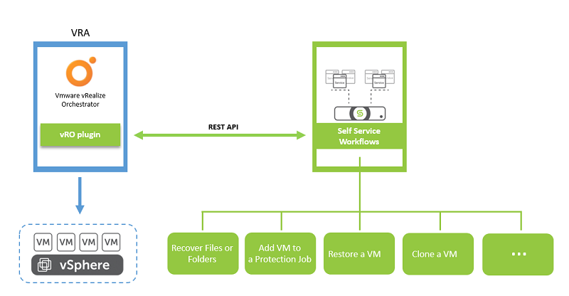

### vRO Self Service Workflows

The plugin provides a list of workflows that you can access on the **Workflows** tab of the Orchestrator client. The plugin contains packages of workflows and actions that you can run on the objects in the inventory to automate the typical use cases of the integrated product.	

| Custom Objects           | Workflows                            |
| ------------------------ | ------------------------------------ |
| Initial Configuration    | Add a Cohesity Endpoint              |
|                          | Remove a Cohesity Endpoint           |
|                          | Update a Cohesity Endpoint           |
|                          | Add an Email Configuration           |
|                          | Remove an Email Configuration        |
|                          | Update an Email Configuration        |
| Day-1 Workflows          | Add multiple VMs to Protection Job   |
|                          | Remove VM from all Protection Job    |
| Protection Job Workflows | Add Unprotected VM to Protection Job |
|                          | Clone Virtual Machine                |
|                          | Move VM to new Protection Job        |
|                          | Remove VM from Protection Job        |
|                          | Restore Virtual Machine              |
|                          | Run Protection Job on Demand         |
|                          | Recover Files or Folders             |

### Features

The vRO plugin provides an inventory of objects that you can access on the Inventory tab of the Orchestrator client, along with packages of workflows and actions that you can run on these objects in the inventory to automate the typical use cases of the integrated product.

- **Managing Cohesity Data Operations**: Allows vRO user to perform operations for backups, data protection, restore and clone on Cohesity sources such as Virtual Machines and vCenters.
- **Managing Data with Multiple ESXi Boxes**: Move protected VM/data within protection jobs and also clone and restore over different ESXi boxes.
- **Multiple Platform Support**: Management of multiple Cohesity DataPlatform setups.

### Prerequisites

| Software              | Version      | Provider                       |
| --------------------- | ------------ | ------------------------------ |
| vCenter Server        | 5.5 or later | VMware                         |
| vRealize Automation   | 7.x          | VMware                         |
| Cohesity DataPlatform | 6.x or later | Cohesity                       |
| Web browsers          | Latest       | Mozilla Firefox, Google Chrome |

### Process Overview

A snapshot of the overall process involved in using the Cohesity vRO plugin is as follows:

1. [Install the Cohesity vRO Plugin](#installing-the-cohesity-vro-plugin)
2. [Configure the Cohesity Plugin](#getting-started-with-cohesity-vro-plugin)
   1. [Add Cohesity Endpoints](#adding-a-cohesity-endpoint) (Mandatory)
   2. [Add Email Configurations](#adding-an-email-configuration) (Optional)
3. [Configure vRA](#configuring-vra)
   1. [Importing Blueprints](#importing-blueprints)
   2. [Configuring Day 1 Workflows](#configuring-day-1-workflows)
4. [Execute Protection Job Workflows](#executing-protection-job-workflows)

### What's New

| Version | What's New                                                   | Revision Date |
| ------- | ------------------------------------------------------------ | ------------- |
| v1.0.2  | Second Draft of vRO plugin documentation. The document has been updated with the current procedures to execute workflows. | May 2019      |
| v1.0.1  | First draft released.                                        | Nov 2018      |

## Installing the Cohesity vRO Plugin

#### In This Section

| Topic                                           | Description                                                  |
| ----------------------------------------------- | ------------------------------------------------------------ |
| [Installing the Plugin](#installing-the-plugin) | This section describes the detailed steps to install the Cohesity vRO plugin. |
| [Removing the Plugin](#removing-the-plugin)     | This section provides information on disabling and removing the Cohesity vRO plugin. |

### Installing the Plugin

This section describes the detailed steps to install the Cohesity vRO plugin.

**Note**: If the Cohesity vRO plugin has already been installed and must be upgraded, you must first [remove](#removing-the-plugin) the existing plugin and then install the new Cohesity vRO plugin. 

##### Procedure

1. Login to the **vRealize Orchestrator** and click **vRealize Orchestrator Control Center**. You must know the credentials to log in to the Control Center.
   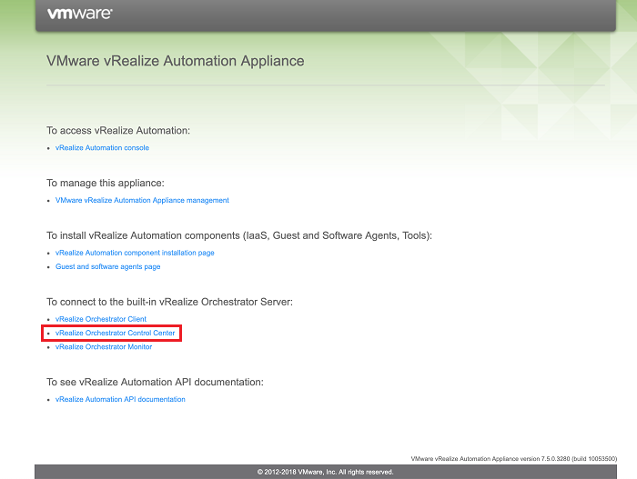
2. Click **Manage Plugins** in the displayed **vCenter Control Center** window.
   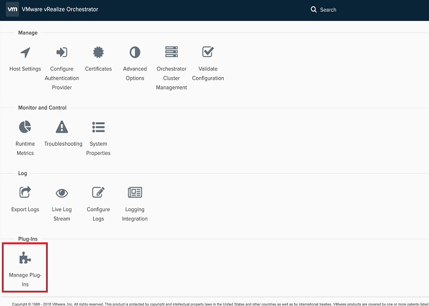
3. In the **Manage Plugins** section, click **Browse** to navigate to the folder where you have saved the ***.vmoapp*** file and select the source installer ***o11nplugin-cohesity-vRO-plugin.vmoapp/.dar.***
   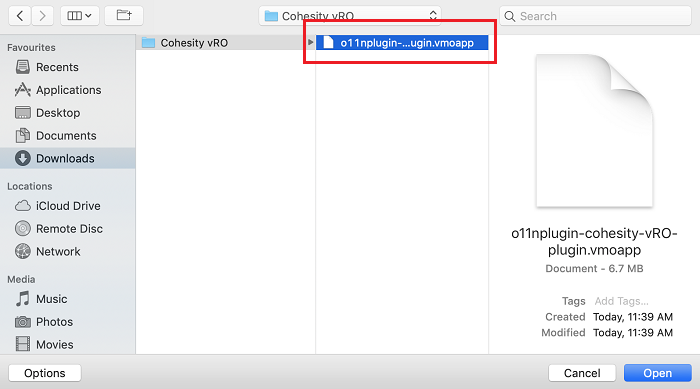
4. Click **Install**.
5. Read the end user license agreement and click **Accept EULA**.
   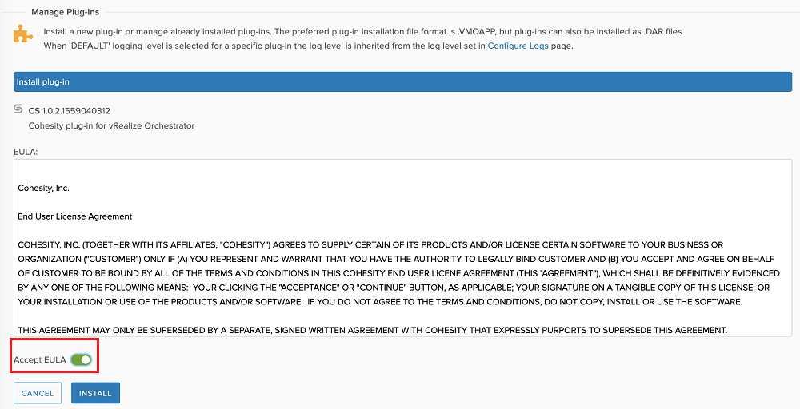
6. Click **INSTALL**. On successful installation of the plugin, the following screen is displayed.
   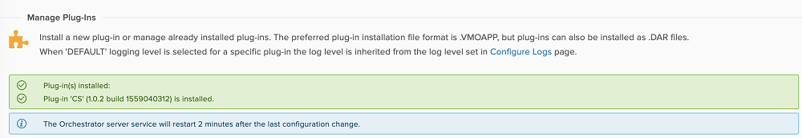
7. Now you can open **vRO**. The plugin is added to the list. On selecting the plugin, the version and details of the plugin are displayed as follows:
   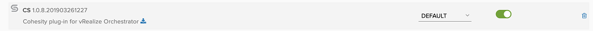

### Removing the Plugin

##### Procedure

This section provides information on disabling and removing the vRO plugin.

1. In a supported browser, launch the **Control Center**. The VMware Orchestrator startup page is displayed.
2. Click the **Orchestrator Control Center** link. The **Control Center** page is displayed.
3. Click **Manage Plugin** in the Control Center. The **Manage Plugin** page is displayed.
4. Toggle off the Cohesity plugin to disable the plugin. Click **Save Changes**.
   
   Alternatively, you can also click the **Remove** icon to remove the plugin. 
5. Log in to vRO client and delete the Cohesity package. 
   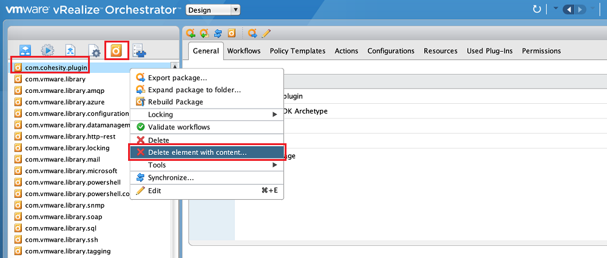
   **Note**: For details on removing the plugin from vRO, see [here](https://kb.vmware.com/s/article/2151653).
6. In the confirmation dialog box, click **DELETE ALL**.
   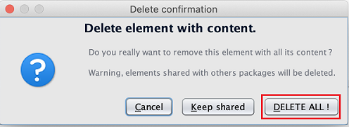
7. Restart the server. The plugin is disabled or removed accordingly. 

## Getting Started with Cohesity vRO Plugin

This section provides the initial configuration, details to add a Cohesity endpoint and Email configuration.

#### In This Section

| Topic                                                        | Description                                                  |
| ------------------------------------------------------------ | ------------------------------------------------------------ |
| [Launching vRO Client](#launching-vro-client)                | This section describes the basic steps to start the vRO Client. |
| [Adding a Cohesity Endpoint](#adding-a-cohesity-endpoint)    | This section describes the details to add an endpoint and to connect vRO with the Cohesity Data Platform |
| [Adding an Email Configuration](#adding-an-email-configuration) (Optional) | This section describes the details about Email configuration to send notification to the intended recipients. |

### Launching vRO Client

This section describes the basic steps to start the vRO clien

##### Prerequisites

Java (JDK version 7 or later) must be installed on the client side.

##### Before You Start

1. Go to the home page of *vra-appliant-ip.*

2. Click on **vRealize Orchestrator** client.

   A *client.jnlp* file is downloaded.

3. Open command prompt and run the following command. 

   **javaws client.jnlp**
   **Note** : The above mentioned steps are not mandatory to be executed if the VRA version is 7.5 or later. The client can directly access the HTML client interface available in VRA to configure the Cohesity plugin.

##### Procedure

The following procedure is to log in to the vRO client.

1. Log in to **VMware vRealize Orchestrator**. You must know the credentials to log in.
   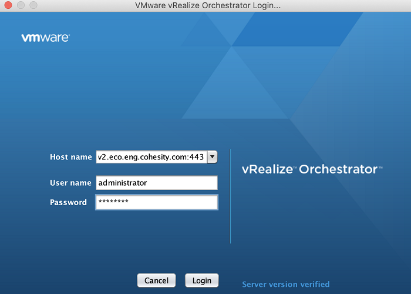
2. Select **Run** mode from the drop-down list located at the top left of the page and then click the **Workflows** tab.
   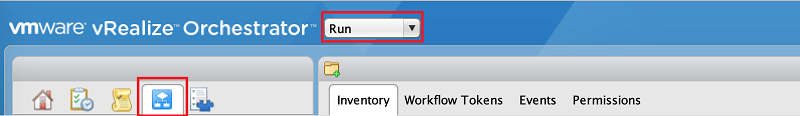
3. Select **Library** > **Cohesity**. All the workflows are listed in the left pane.

### Adding a Cohesity Endpoint

##### Procedure

This section describes the details to add an endpoint and to connect vRO with the Cohesity data platform.

1. Log in to **VMware vRealize Orchestrator**. You must know the credentials to log in.
2. Select **Run** mode from the drop-down list located at the top left of the page and then click the **Workflows** tab.
3. Select **Library** > **Cohesity** > **Configuration** > **Add a Cohesity Endpoint**.
   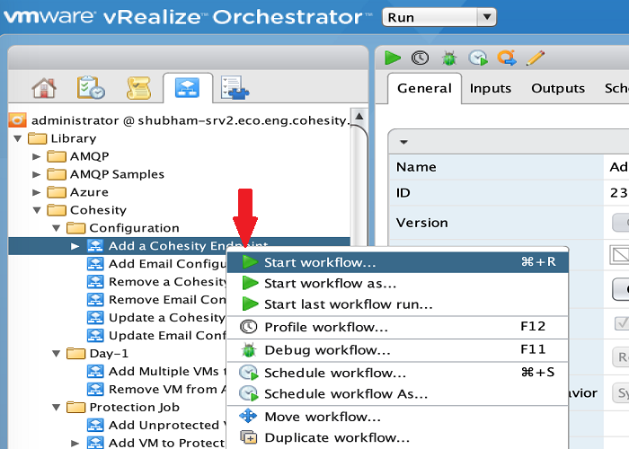
4. To start the workflow, click or right click and select **Start workflow...** 
   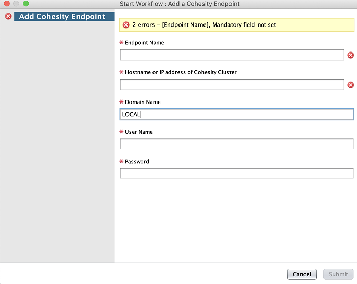
   The **Add a Cohesity Endpoint** window is displayed
5. Enter the following details:
   - **Endpoint Name**: Enter an endpoint name.
   - **Hostname or IP address of Cohesity Cluster**: Enter the Cohesity data platform URL you want to connect to.
   - **Domain Name**: This is the user defined domain name. 
   - **User Name and Password**: Enter the credentials of the Cohesity DataPlatform.
6. Click **Submit** to add an endpoint successfully.

### Adding an Email Configuration

This section describes the details about Email configurations to send notification to the intended recipients for Recover of Files or Folders workflow.

##### Procedure (Optional)

To add an Email configuration:

1. Log in to **VMware vRealize Orchestrator**. You must know the credentials to log in.
2. Select **Run** mode from the drop-down list located at the top left of the page and then click the **Workflows** tab.
3. Select **Library** > **Cohesity** > **Configuration** > **Add Email Configuration**.
4. To start the workflow, click . The **Add Email Configuration** screen is displayed.
   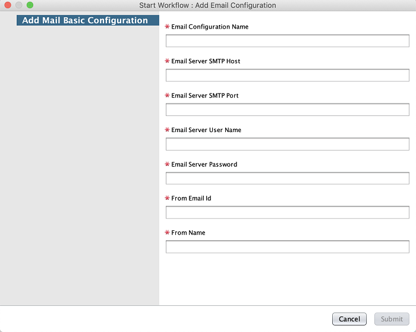
5. Enter the following details:
   - **Email Configuration Name**: Enter an Email configuration name to identify while using it in another workflow.
   - **Email Server SMTP Host**: Enter the SMTP host name such as gmail.com
   - **Email Server SMTP Port**: Enter the SMTP port number.
   - **Email Server User Name**: Enter the Email server user name.
   - **Email Server Password**: Enter the Email server password.
   - **From Email Id**: Enter the Email ID from where the notification is sent.
   - **From Name**: Enter the name of a person who needs to be in notification sender.
6. Click **Submit** to add an Email configuration.

## Configuring vRA

#### In this Section

| Topic                                                        | Description                                                  |
| ------------------------------------------------------------ | ------------------------------------------------------------ |
| [Importing Blueprints](#importing-blueprints)                | This section describes the details to import the XAAS blueprints. |
| [Configuring Day 1 Workflows](#configuring-day-1-workflows) (Optional) | This section describes the details to configure vRA for Day-1 workflows. If Day-1 Workflows are not required, this section can be skipped. |

### Importing Blueprints

This section describes the details to import the XAAS blueprints. 

##### Prerequites

- Cohesity vRO Plugin - Ensure that the plugin is installed and configured on the vRO. Click [here](#installing-the-plugin) for the detailed procedure.
- [Cloud Client](https://code.vmware.com/web/tool/4.7.0/cloudclient) - The vRealize command line utility must be available to import pre built blueprints and use cases in vRA.

##### Procedure

1. Download the Cohesity vRA Blueprint file available in the [repository](https://github.com/cohesity/cohesity-vra-blueprints/tree/master/config/vRA/build).  
2. Launch Cloud Client instance on your local system by executing `bin/cloudclient.bat (for windows) or bin/cloudclient.sh for OSX / Linux`.
   The following screen is displayed.
   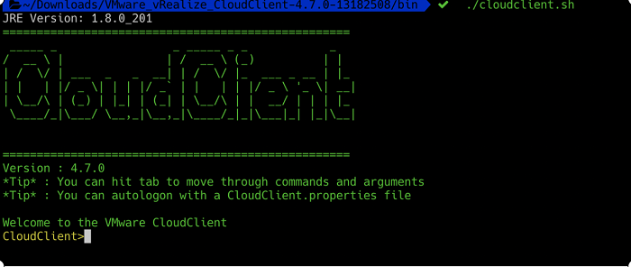
3. Login to the vRA appliance and vRA infrastructure server using the following command.
   `vra login userpass --user <userName> --tenant <tenantName> --server <vRA appliance server> --password <user-password>`
   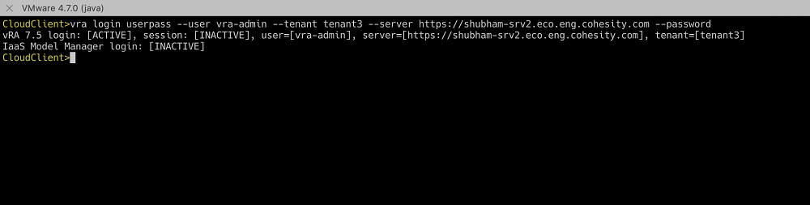
4. Import the blueprint file using the following command. 
   `vra content import --path <path-to-zip-file> --resolution OVERWRITE --precheck WARN`
   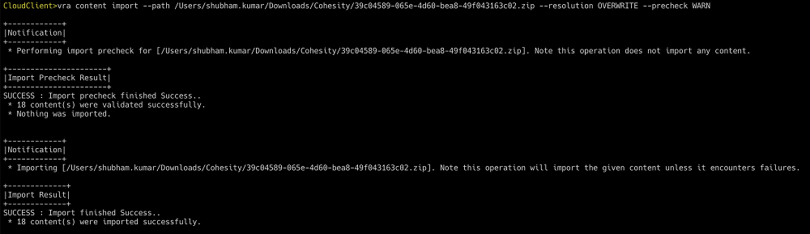
5. To verify if the import was successful, in VRA, navigate to **Design** > **XaaS** > **XaaS Blueprints**.
   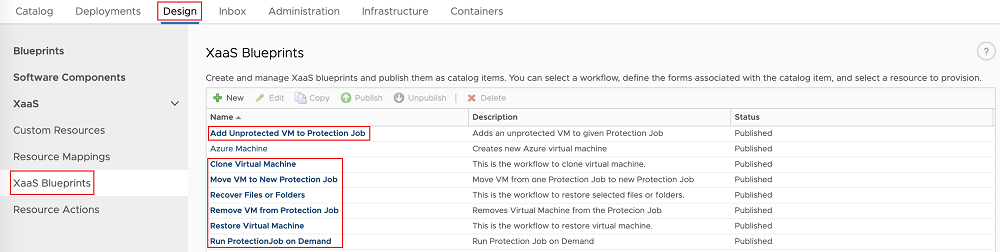
6. Navigate to **Design** > **XaaS** > **Resource Actions** to confirm successful import of Resource Actions. 
   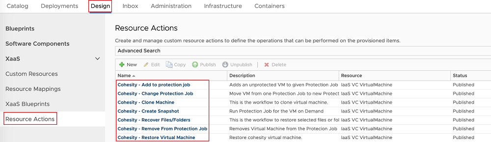
   **Note**: Ensure that the various users are entitled to the newly imported catalog items and resource actions. Click [here](https://docs.vmware.com/en/vRealize-Automation/7.4/com.vmware.vra.prepare.use.doc/GUID-F283E64D-9000-4129-82AC-6C1C95E36B6F.html) for more details.

### Configuring Day 1 Workflows

You need to perform the following only if you have to configure vRA for Day-1 workflows. Else, this section can be skipped. 

By configuring Day 1 Workflows, the VMs are added to the specified protection job when newly provisioned from VRA or removed from the protection job when the VM is destroyed. 

#### Assigning Properties to Blueprint

##### Procedure

This section describes the steps you need to perform to configure vRA property definition and groups.

1. In the **Design** tab, select **Blueprints**.
2. Select an existing blueprint from the **Blueprints** pane. 
3. In the **Design Canvas** page, click the vSphere machine component (highlighted on the top of the page) and click the **Properties** tab. Add the property group **Subscription Cycle**.
   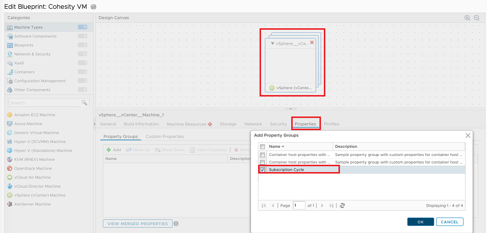
4. Click the **Custom Properties** tab.
5. Add *com.cohesity.endpointName* and *com.cohesity.protectionJobName* and then set **Show in Request** to **Yes**.
6. Click **SAVE** to save the changes.
   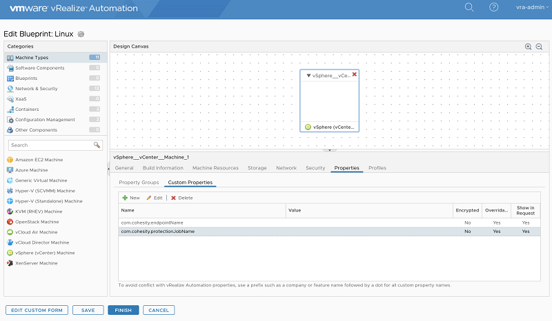

#### Configuring Event Subscription

This section describes the steps you need to perform to create and configure event subscription. 

##### Procedure

1. Click **Administration** > **Events** > **Subscriptions**.
2. To create a new workflow subscription, click the **New** icon.
   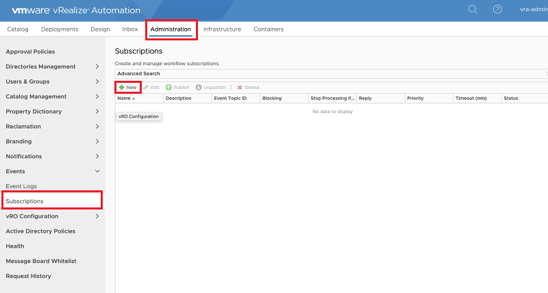
3. Select **Machine Provisioning** in the **Event Topic** page. Click **Next**.
   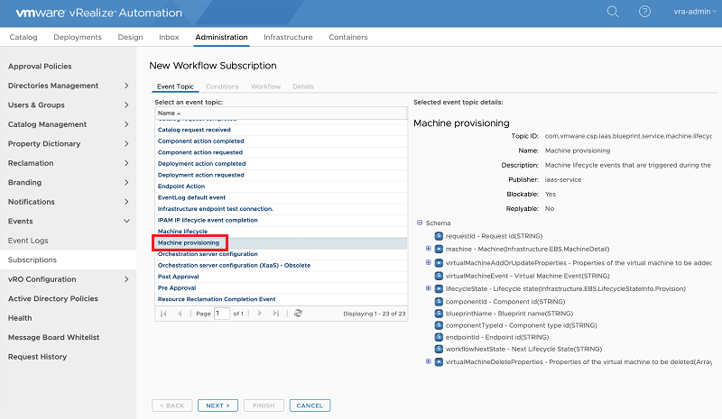
4. In the **Conditions** tab, select the following values and click **Next**.
   - *Run based on conditions* = *All of the following*.
   - *Data* > *Blueprint Name* = *Cohesity (blueprint name to provision VM)* 
   - *Data* > *Lifecycle State* >*Lifecycle State Name* = *VMPSMasterWorkflow32.MachineProvisioned* 
   - *Data* > *Lifecycle State* > *State phase* = *POST*
   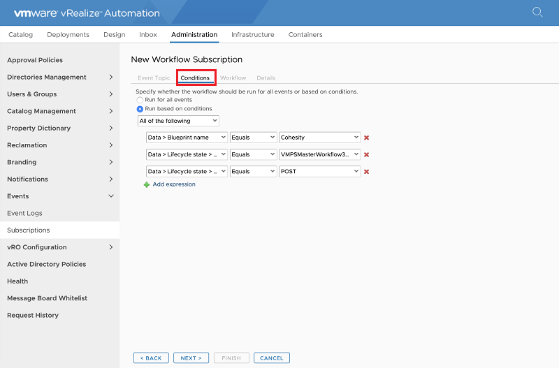

5. In the **Workflow** tab, select the workflow from Orchestrator and add this DAY-1 workflow of **Add Multiple VMs to** **Protection Job**.
   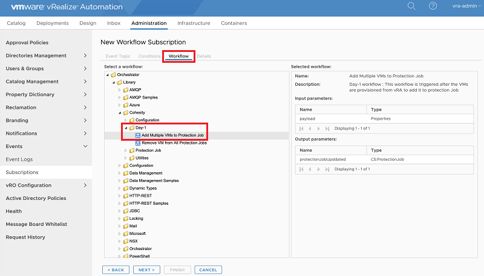
6. In the **Details** tab, a new Subscription with a relevant name is displayed (It will use the Workflow name by default). Click **Finish**.
   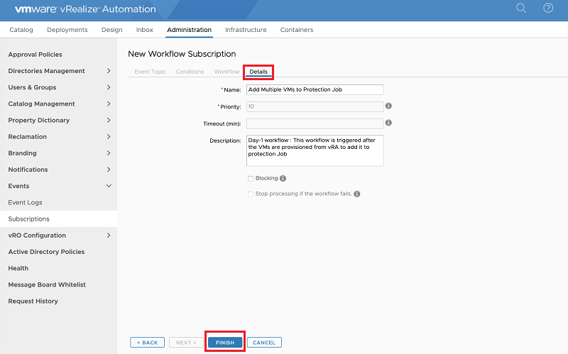
7. Select the newly created subscription and click **Publish**.
   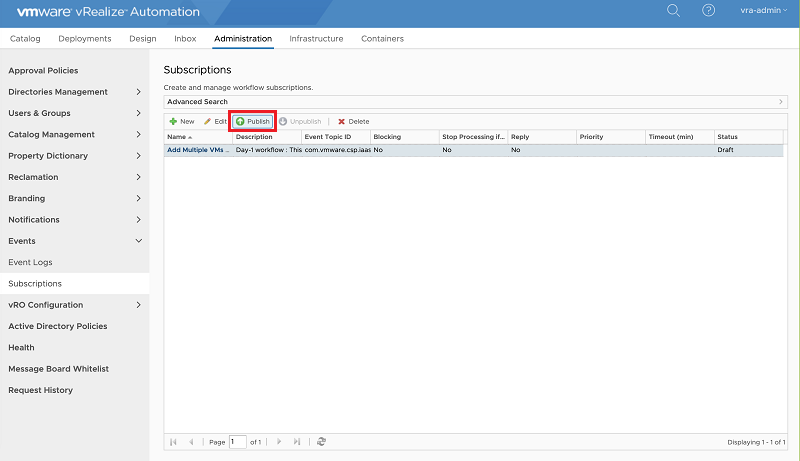

#### Remove VM from Protection Job

##### Procedure

To remove VM from Protection Job when VM is destroyed:

1. Click **Administration** > **Events** > **Subscriptions**.

2. Click the **New** icon and select **Machine Provisioning** in the **Event Topic** page.
   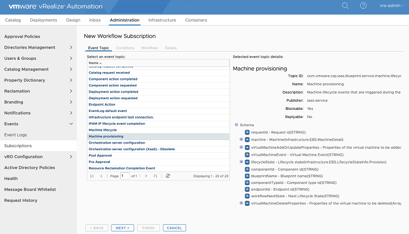

3. In the **Conditions** tab, select the following and click **Next**.

   - *Run based on conditions = All of the following*.
   - *Data > Blueprint Name = Cohesity (BluePrint name to the provision VM)*
   - *Data > Lifecycle State >Lifecycle State Name = VMPSMasterWorkflow32.UnprovisionMachine*
   - *Data > Lifecycle State > State phase = PRE*
     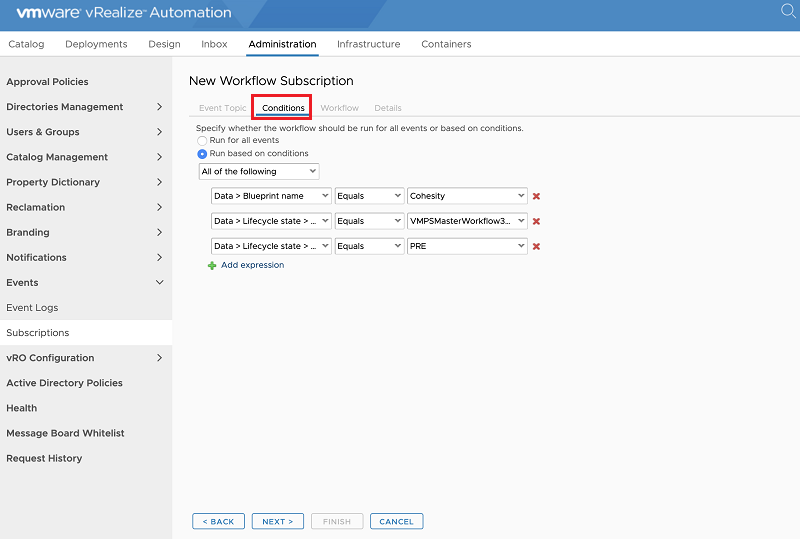

4. Select the workflow from Orchestrator and select the **DAY-1** workflow of **Remove** **VM from All Protection Jobs** in this page.
   

5. In the **Details** tab, enter the new **Subscription** **Name** (It will use the Workflow name by default) and then click **Finish**.
   

6. Select the newly created subscription and publish it.
   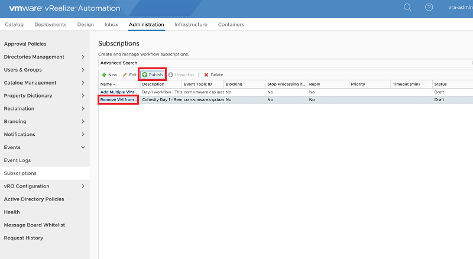

   After you have completed the above configurations, click the **Cohesity Provision VM**.
   **Note**: Here, **Cohesity Provision VM** is given as an example. This name could differ based on the client's configuration. 
   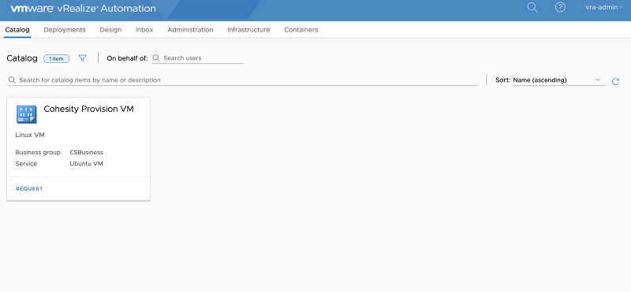

## Executing Protection Job Workflows

You can execute the following actions in the Day-2 workflows. These workflows can be executed as a XAAS or resource actions. 

#### In This Section

| Topic                                                        | Description                                                  |
| ------------------------------------------------------------ | ------------------------------------------------------------ |
| [Adding an unprotected VM to protection job](#adding-an-unprotected-vm-to-protection-job) (XAAS) | This section describes the details to add an unprotected VM to a Protection Job. |
| [Cloning a VM](#cloning-a-virtual-machine) (XAAS)            | This section describes the details to clone a Virtual Machine. |
| [Moving a VM to a New Protection Job](#moving-a-vm-to-a-new-protection-job) (XAAS) | This section describes the details to move a VM to a new protection job. |
| [Removing a VM from a Protection Job](#removing-a-vm-from-a-protection-job) (XAAS) | This section describes the details to remove a VM from a protection job. |
| [Restoring a Virtual Machine](#restoring-a-virtual-machine) (XAAS) | This section describes the details to restore a Virtual Machine. |
| [Executing a Protection Job on Demand](#executing-a-protection-job-on-demand) (XAAS) | This section describes the details to run a protection job on demand. |
| [Recovering Files or Folders](#recovering-files-or-folders) (XAAS) | This section describes the details to recover a file or a folder. |
| [Executing a Protection Job on Demand](#executing-a-protection-job-on-demand-as-resource-action) (Resource Action) | This section describes the details to run a protection job as a Resource Action in vRA. |

**Note**: The steps to execute a protection job on demand as a XAAS and a resource action has been captured in this section. All the other workflows can also be similarly executed either as a XAAS or a resource action. 

### Adding an Unprotected VM to Protection Job

##### Procedure (XAAS)

To add an unprotected VM to a protection job:

1. Log in to vRA using valid credentials. The list of Catalog Items are displayed in the Catalog Dashboard.   
   Ensure that you have the necessary **Entitlements** to **Cohesity Catalog Items**. 
   To access **Entitlements**, in vRA go to **Administration > Catalog Management > Entitlements**. 
2. Click **REQUEST** on **Add Unprotected VM to Protection Job**. 
   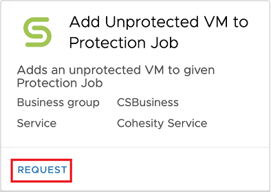
3. Select the **Cohesity Endpoint** and the **Virtual Machine** from the drop down list.
   **Note**: In the drop down list for Virtual Machines, only the unprotected VMs are displayed. 
4. Select the **Protection Job** to which the Virtual Machine must be assigned. 
   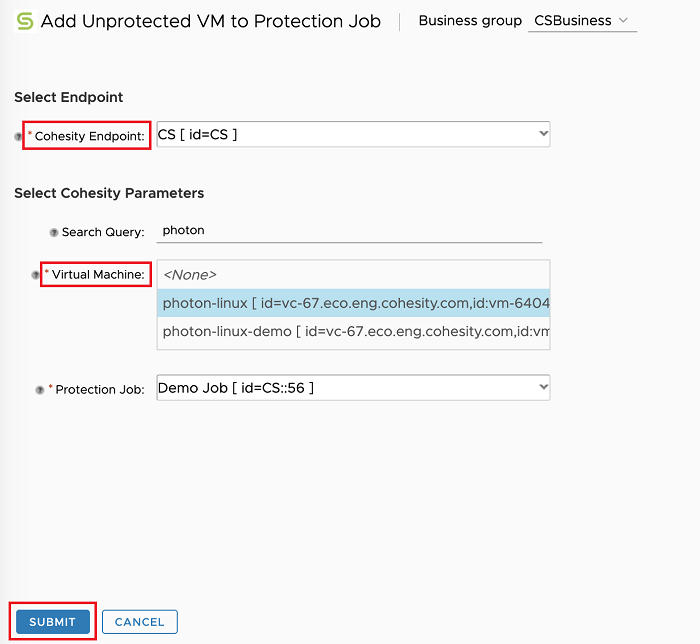
5. Click **Submit**.
   You can monitor the progress of the request in the **Deployments** tab.

### Cloning a Virtual Machine

##### Procedure (XAAS)

You can clone a virtual machine as follows. 

1. In the Catalog Dashboard, click **REQUEST** on **Clone Virtual Machine**. 
   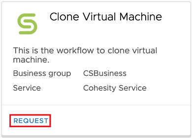
2. Select the **Cohesity Endpoint** and the **Virtual Machine** from the drop down list.
3. Ensure that the **Machine Protected** flag in **Select Input Parameters** screen is set to **Yes**. 
   If this is not set to **Yes**, then the machine cannot be cloned as no restore objects are available in the cluster. 
4. Select **vCenter**, **DataCenter**, **Cluster**, **Network**, **Protection Job**, **Resource Pool**, **View**, **Snapshot**, **Machine Prefix** and **Machine Suffix** from the corresponding drop down list. 
   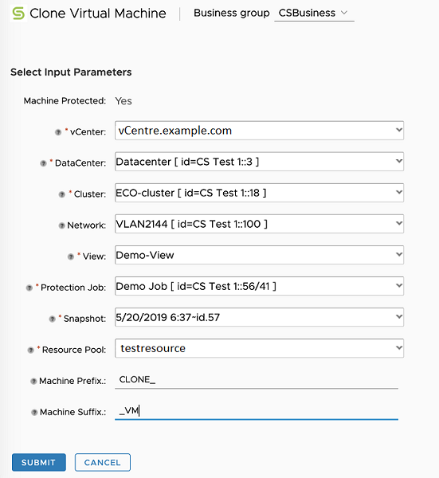
5. Click **Submit**.

### Moving a VM to a New Protection Job

##### Procedure (XAAS)

You can move a VM to a new protection job as follows.

1. In the Catalog Dashboard, click **REQUEST** on **Move VM to New Protection Job**.
   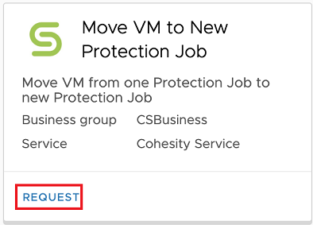
2. Select the **Cohesity Endpoint** from the drop down list.
3. Select the Cohesity Parameters such as **Virtual Machine**, its **Current Protection Job**, and the **New Protection Job** it must be assigned to. 
   **Note**: In the drop down list for Virtual Machines, only the protected VMs are displayed.
   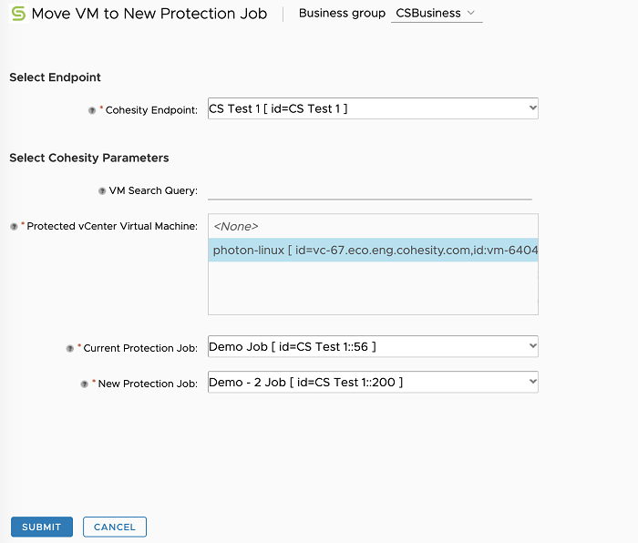
4. Click **Submit**. 

### Removing a VM from a Protection Job

##### Procedure (XAAS)

To remove a VM from a Protection Job:

1. In the Catalog Dashboard, click **REQUEST** on **Remove VM from Protection Job**.
   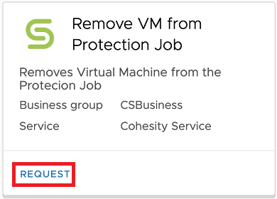
2. Select the **Cohesity Endpoint** from the drop down list.
3. Select the Cohesity Parameters such as **Virtual Machine** and the corresponding **Protection Job**. 
   **Note**: In the drop down list for Virtual Machines, only the protected VMs are displayed.
   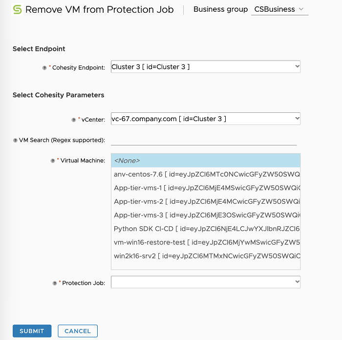
4. Click **Submit**.

### Restoring a Virtual Machine

##### Procedure (XAAS)

To restore a VM:

1. In the Catalog Dashboard, click **REQUEST** on **Restore Virtual Machine**.
   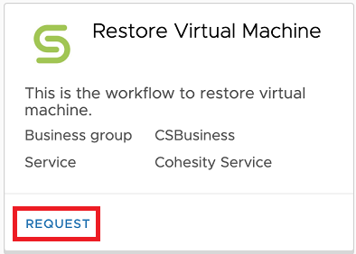
2. Select the **Cohesity Endpoint** and the **Backup Candidates** from the drop down list.
   **Note**: The Backup Candidates are the VMs that are already protected in the Cohesity Data Protection. 
   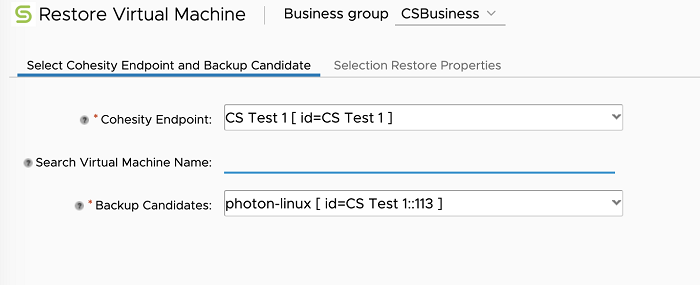
3. Click **Selection Restore Properties** tab and enter the protection job you want to perform the restore from in the **Protection Job** field.
   Note: The list populated in the drop down of **Protection Job** may contain multiple values if the backup candidate is protected by multiple jobs. 
4. Select the **Snapshot** from which you want to execute the restore.
5. Optionally, you can provide the **Machine Prefix** and **Machine Suffix**.
6. By default, the VM is powered OFF after restore. Select as required and click **Submit**.
   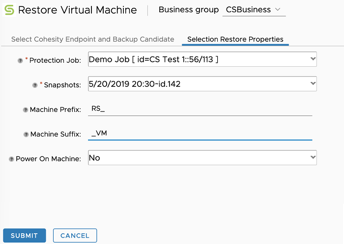

### Executing a Protection Job on Demand

##### Procedure (XAAS)

To execute a Protection Job:

1. In the Catalog Dashboard, click **REQUEST** on **Run Protection Job on Demand**.
   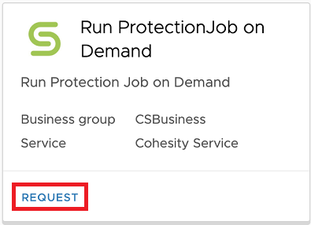
2. Select the **Cohesity Endpoint** from the drop down list.
3. In the **Protection Job** field, enter the protection job you want to execute.
4. In the **Run Type** field, you can select either **Regular (Incremental CBT) or Full (No CBT)**.
   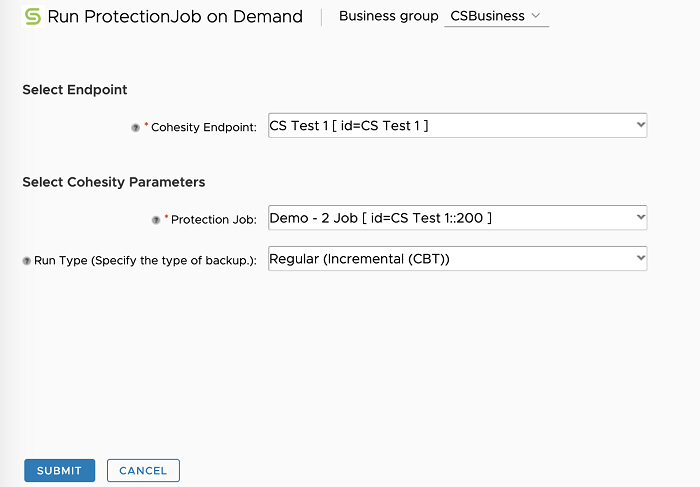
5. Click **Submit**.

### Recovering Files or Folders

##### Procedure (XAAS)

To recover a file or folder:

1. In the Catalog Dashboard, click **REQUEST** on **Recover Files or Folders**.
     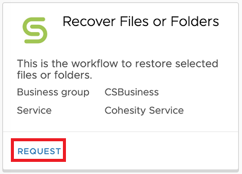
2. Select the **Cohesity Endpoint** from the drop down list.
3. In the **Search Virtual Machine Name** field, enter the virtual machine from which you want to recover a file or folder. A list of backup candidates is populated based on the selection.
4. In the **Backup Candidates** field, select the required VM from the populated list.
5. In the **Protection Job** field, select the required protection job from the populated list.
6. In the **OS Type** field, select either Linux or Windows based on the chosen VM so as to
     display the file or folder path in proper format.
7. In the **User Name** field, provide user name for the selected VM.
8. In the **Password** field, provide password for the selected VM.
     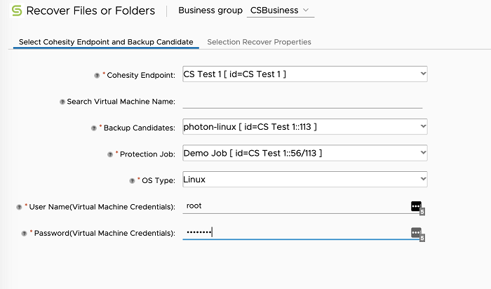
9. In **Selection Recover Properties** tab:
     1. In **Files or Folders** field, select option to search for files, folders or both.
     2. In the **Search Files or Folders Name** field, you can provide the search text to fetch the appropriate file or folder or both from the selected protection job. The search text can be a prefix or suffix or mid name of the file or folder name.
     3. Search responses such as file or folder path or both is listed in the **Files** **Backup Candidates** field.
     4. In the **File Snapshots** field, recovery points for the selected file or folder path is listed.
     5. Select **Yes** or **No** for **Recover to Original Location** parameter. If **Yes** is selected, file or folder is recovered to the original location from where it is backed up. If **No** is selected, **Recover To** field appears where you can specify the new path to recover the file or folder.
     6. Select **Yes** or **No** for **Overwrite Existing File/Folder** parameter. If **Yes** is selected, file or folder is overwritten, else a new folder is created to recover the file or folder.
     7. Select **Yes** or **No** for **Continue on Error** parameter. If **Yes** is selected, recovery is continued even when there is any error, else recovery stops when there is an error.
     8. Select **Yes** or **No** for **Preserve Attributes** parameter.
          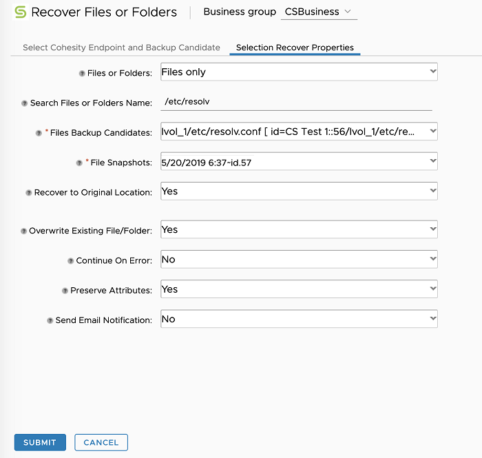
     9. Select **Yes** or **No** for **Send Email Notification**. If **Yes** is selected, the **Mail Configuration to Send Notification** tab is enabled to choose Email connection and other related parameters.
          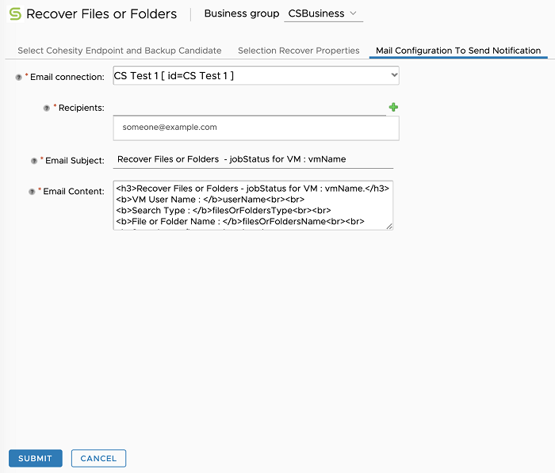
          1. In the **Email connection** field, select the Email connection which is already configured.
          2. In the **Recipients** field, add one or more Email recipients.
          3. In the **Email Subject** field, subject is auto populated. However, it can be edited.
          4. In the **Email Content** field, model text is auto populated in HTML format and you can edit it as per the need.
10. Click **Submit** to start the workflow execution.
     **Note**: The VM must be powered on for the workflow execution to be successful.

### Executing a Protection Job on Demand as Resource Action

##### Procedure (Resource Action)

To execute a Protection Job as a Resource Action in VRA:

1. In the **Deployments** tab , click on the required provisioned VM.
2. In the **Components** pane in the bottom left of the screen, click on **Actions** icon (as highlighted in the figure).
3. Select **Cohesity-Create Snapshot**.
   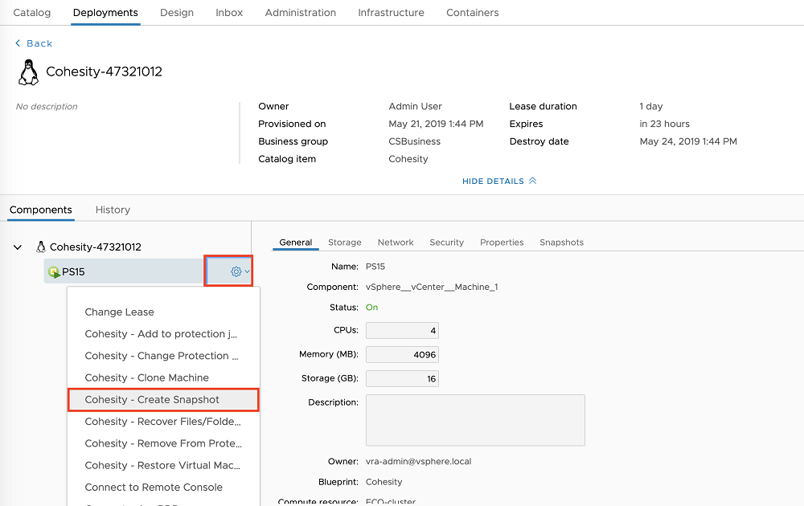
4. Select the **Cohesity Endpoint** from the drop down list.
5. Ensure that the **VM Protected** flag is set to **Yes**.
   If this is not set to Yes, assign the VM to a protection job first. 
6. In the **Protection Job** field, enter the protection job you want to execute.
7. In the **Run Type** field, you can select either **Regular (Incremental CBT) or Full (No CBT)**.
   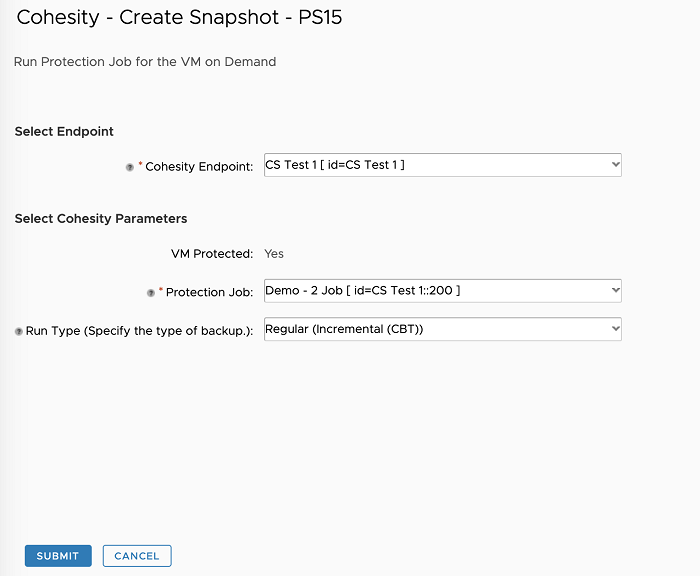
8. Click **Submit**.
   To monitor the progress, log in to the Cohesity Dashboard and click **Protection** tab to view the progress. 

## Other Workflows

#### In This Section

| Topic                                                        | Description                                                  |
| ------------------------------------------------------------ | ------------------------------------------------------------ |
| [Removing a Cohesity Endpoint](#removing-a-cohesity-endpoint) | This section describes the details to remove an existing Endpoint. |
| [Updating a Cohesity Endpoint](#updating-a-cohesity-endpoint) | This section describes the details to update a Cohesity Endpoint. |
| [Removing Email Configuration](#removing-email-configuration) | This section describes the details to remove the Email configuration. |
| [Updating Cohesity Email Configuration](#updating-cohesity-email-configuration) | This section describes the details to update an Email configuration. |

### Removing a Cohesity Endpoint

##### Procedure

To remove an endpoint:

1. Log in to **VMware vRealize Orchestrator**. You must know the credentials to log in.
2. Select **Run** mode from the drop-down list located at the top left of the page and then click the Workflows tab.
3. Select **Library** > **Cohesity** > **Configuration** > **Remove a Cohesity Endpoint**.
4. To start the workflow, click . The **Remove a Cohesity Endpoint** screen is displayed.
   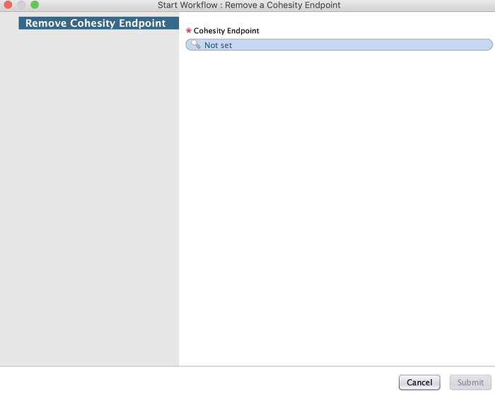
5. In the **Cohesity Endpoint** field, click the **Not set** link to select the endpoint you want to remove. The following screen is displayed.
   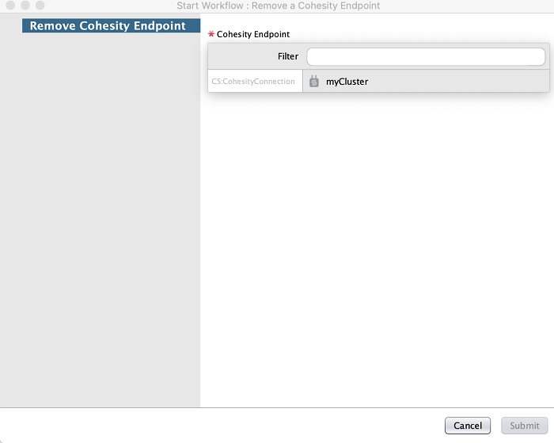
6. Select the required endpoint and click **Select**.
   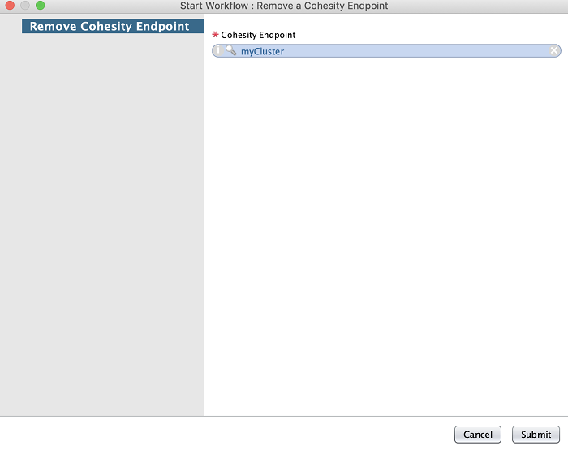
7. Click **Submit** to remove the selected endpoint.

### Updating a Cohesity Endpoint

##### Procedure

To update an endpoint:

1. Log in to VMware vRealize Orchestrator. You must know the credentials to log in.
2. Select **Run** mode from the drop-down list located at the top left of the page and then click
   the Workflows tab.
3. Select **Library** > **Cohesity** > **Configuration** > **Update a Cohesity Endpoint**.
4. To start the workflow, click . The **Update a Cohesity Endpoint** screen is displayed.
   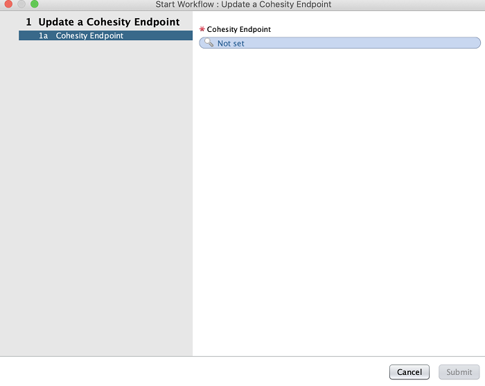
5. In the **Cohesity Endpoint** field, click the **Not set** link to select the endpoint you want to update. The following screen is displayed.
   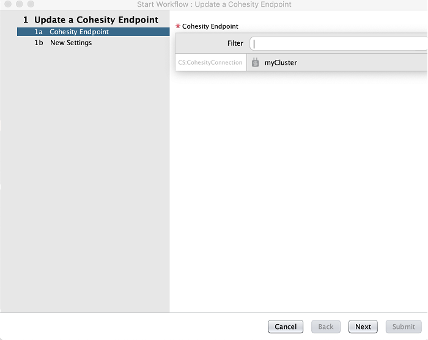
6. Select the endpoint you want to update, click **Select** and then click **Next**.
7. Enter the details you want to update and click **Submit**.
   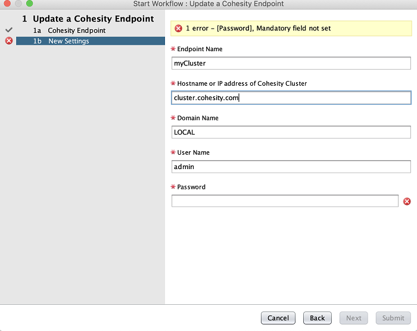

### Removing Email Configuration

##### Procedure

To remove Email configuration:

1. Log in to VMware vRealize Orchestrator. You must know the credentials to log in.
2. Select **Run** mode from the drop-down list located at the top left of the page and then click the Workflows tab.
3. Select **Library** > **Cohesity** > **Configuration** > **Remove Email Configuration**.
4. To start the workflow, click . The **Remove Email Configuration** screen is displayed.
   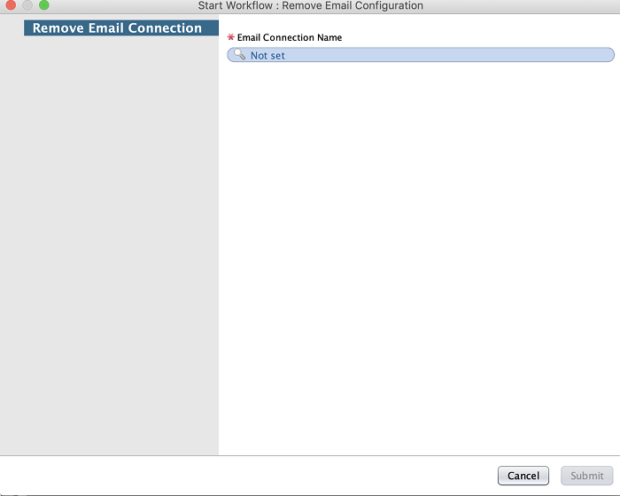
5. In the **Email Connection Name** field, click the **Not set** link to select the **Email** **configuration** you want to remove. The following screen is displayed with the available Email
   Configurations listed.
   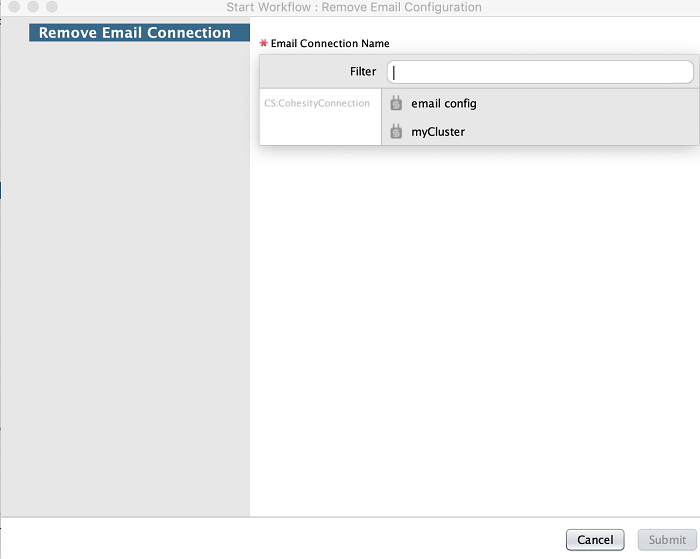
6. Select the required **Email Configuration** and click **Select**.
7. Click **Submit** to remove the selected Email configuration.

### Updating Cohesity Email Configuration

##### Procedure

To update an Email configuration:

1. Log in to VMware vRealize Orchestrator. You must know the credentials to log in.
2. Select **Run** mode from the drop-down list located at the top left of the page and then click the Workflows tab.
3. Select **Library** > **Cohesity** > **Configuration** > **Update Email Configuration**.
4. To start the workflow, click . The **Update Email Configuration** screen is displayed.
   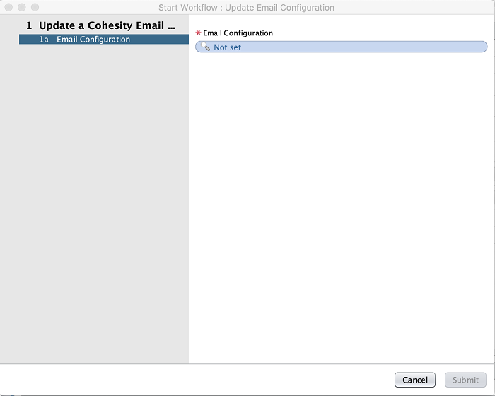
5. In the **Email Configuration** field, click the **Not set** link to select the Email configuration you want to update. The following screen is displayed with the available Email configurations listed.
   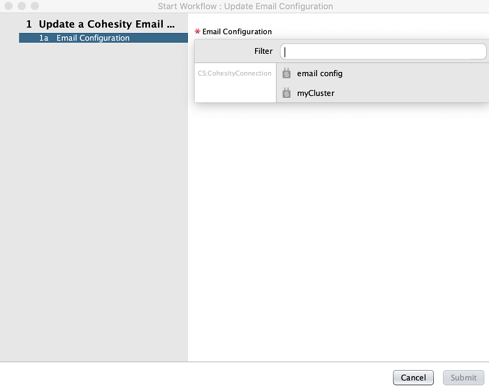
6. Select the Email configuration you want to update, click **Select** and then click **Next**.
7. Enter the details you want to update and click **Submit**.
   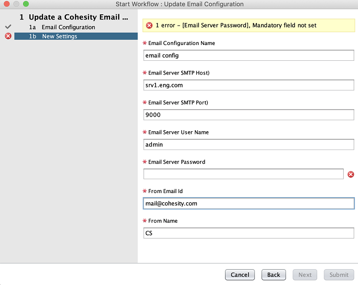

## Feedback
We love to hear from you. Please send your feedback and suggestions to cohesity-api-sdks@cohesity.com
